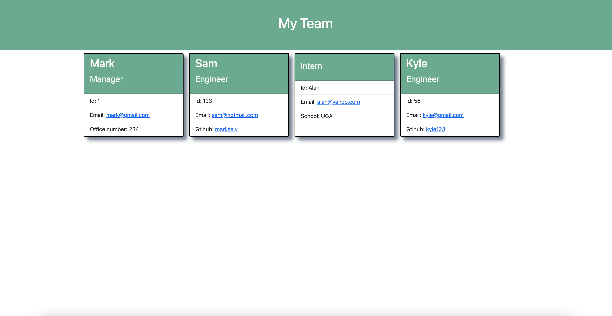

# Team Profile Generator

  ## Description

  This application generates cards with information that a user inputs about team memebers. When a user runs application using node index.js in the terminal of their Visual Studio Code, they are met with a series of prompts that they answer in order to build their team. Once they are done adding memebers their team is generated in an html file(image below shows what the page looks like).

  ## Table of Contents

  * [Installation](#installation)

  * [Usage](#usage)

  * [License](#license)

  * [Tests](#tests)

  * [Questions](#questions)

  ## Installations 

  Run npm i to install all necessary independencies in order to be able to run this application.

  ## Usage
  
   Steps:

  1. Install independencies using - npm i
  2. To initialize the app, use the terminal in Visual Studio Code
  3. Run this command in the terminal - node index.js
  4. Answer all prompts and the html file with your team will be generated for you!
  

  ## License 

  NONE

  ## Tests

  To run tests on this application run the command npm test in your terminal inside the tests folder.

  ## URL Demonstration
  https://watch.screencastify.com/v/81eCyF3uftiFjgujt2iT

  ## Page Preview 

  

  ## Questions 

  For more information about me checkout my github at https://github.com/marksely. For any questions regarding this repository 
  or how to use this generator please email me at mark.sel9@gmail.com.
